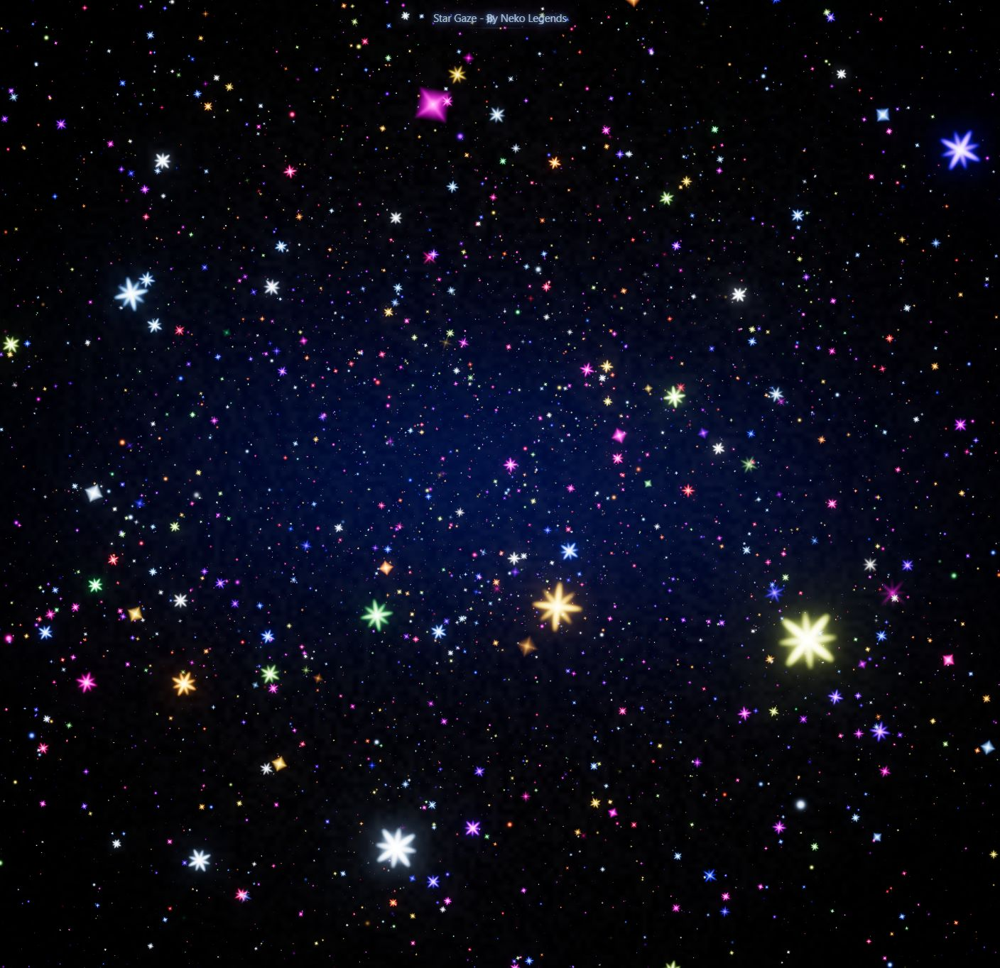

# StarGaze

StarGaze is a public motion-art wallpaper by Neko Legends (`@softpoo` on X): a deep, glittering field of colored stars, pinpoints, diamonds, and flare-shaped sparkles drifting through space.

The default motion is `direction=away`, which makes the stars recede into the distance. Use `direction=forward` for the stronger tunnel effect where stars rush toward the viewer and bloom outward. The project is built with Three.js and follows the same local browser, Lively Wallpaper, and Windows screensaver setup as PurplePlanet.



## Run locally

```powershell
npm install
npm run dev
```

Then open the local URL printed by Vite.

## Use as a live wallpaper

For Windows desktop live wallpaper use, Lively Wallpaper is the recommended host. Windows itself does not provide a native animated web wallpaper system, and the included `.scr` host is for screensaver mode rather than always-on desktop wallpaper mode.

Double-click this to build the static wallpaper bundle and Lively package:

```text
Build-LiveWallpaper.bat
```

Or run the PowerShell script directly:

```powershell
powershell -NoProfile -ExecutionPolicy Bypass -File scripts/package-lively.ps1
```

Generated outputs:

- `live-wallpaper/` is the self-contained static web wallpaper.
- `packages/StarGaze.zip` is the Lively package.

For Lively Wallpaper, drag `packages/StarGaze.zip` into the Lively window, select Star Gaze, then apply it to the desired monitor or span layout. Enable Start with Windows inside Lively if you want it to run on boot. Current Lively builds import wallpaper packages through the `.zip` extension; a `.lively` copy may be rejected as "file not supported."

For Wallpaper Engine, create a web wallpaper from `live-wallpaper/index.html`.

## Use as a Windows screensaver

This is separate from live wallpaper mode. Use this only if you want Star Gaze as the Windows screensaver that appears after idle time.

Double-click this from the repo root:

```text
Install-Screensaver.bat
```

The installer builds/uses `live-wallpaper/`, updates `StarGaze\config.json`, creates `StarGaze.scr`, registers it for the current Windows user, and opens Windows Screen Saver Settings. It does not need admin rights.

Optional timeout:

```powershell
.\Install-Screensaver.bat -TimeoutSeconds 600
```

## Wallpaper tuning

Use URL parameters when adding it to a wallpaper app:

- `?quality=low`, `?quality=balanced`, `?quality=high`, or `?quality=cinematic` controls star count, sparkle, pixel ratio, and exposure.
- `?direction=away` makes the field recede into depth. This is the default.
- `?direction=forward` makes the stars rush toward the viewer.
- `?fps=30` is the default cap. Use `?fps=24` for lower GPU use, `?fps=60` for smoother motion, or `?fps=0` to render every display refresh.
- `?speed=0.7` slows the depth drift. Higher values move faster.
- `?density=1.4` increases the number of stars and dust motes.
- `?sparkle=1.5` increases star twinkle and flare intensity.
- `?starScale=1.25` makes stars larger.
- `?rotation=0` controls optional whole-field roll. It is off by default.
- `?starSpin=1.8` increases the individual sparkle/flare rotation.
- `?fadeSpeed=1.4` changes how quickly stars wink in and out across the layered field.
- `?farBlinkSpeed=1.5` changes the static far-field white/blue twinkle rate.
- `?bloom=0.3`, `?bloomRadius=0.45`, and `?bloomThreshold=0.7` tune the glow around bright stars.
- `?postprocessing=false` disables bloom if you need a lighter render.
- `?tunnelWidth=60` changes the spread of the star tunnel.
- `?pixelRatio=1.35` is the cinematic default. Lower it toward `1` for less GPU load.
- `?cameraSway=0` disables the slow camera drift.
- `?theme=stargaze`, `?theme=prism`, `?theme=frost`, `?theme=jewel`, or `?theme=ember` selects a built-in palette.
- `?palette=ffffff,8fc7ff,2758ff,8c3dff,ff41df,ff4b32,ffd34f` provides a custom palette.
- `?title=false` hides the small title.

Example:

```text
http://127.0.0.1:5173/?quality=cinematic&fps=30&direction=away&speed=1&pixelRatio=1.35&theme=stargaze
```

Forward rush variant:

```text
http://127.0.0.1:5173/?quality=cinematic&direction=forward&speed=1.25&sparkle=1.4
```

Extra dense and glowy:

```text
http://127.0.0.1:5173/?quality=cinematic&density=1.5&starSpin=1.8&fadeSpeed=1.35&farBlinkSpeed=1.4&bloom=0.3&bloomThreshold=0.7&sparkle=1.6
```

For a mixed landscape/portrait monitor setup, configure the wallpaper host to span one web wallpaper across the full virtual desktop when available. Running separate instances per monitor will still look good, but the star positions will not be mathematically continuous across screen edges.

## Music Assets

Bundled music lives in `public/` so Vite copies it into `live-wallpaper/` and the Lively package. The current track is `public/Star Gaze.mp3`. The source code can remain open source while music is documented separately in `public/ASSET-LICENSE.md`.

## License

StarGaze source code is MIT licensed. The bundled music has an additional asset note in `public/ASSET-LICENSE.md`.

## Credits

Created by Neko Legends (`@softpoo`), with AI development assistance from Eva.

- Website: https://nekolegends.com
- X/Twitter: https://x.com/softpoo
